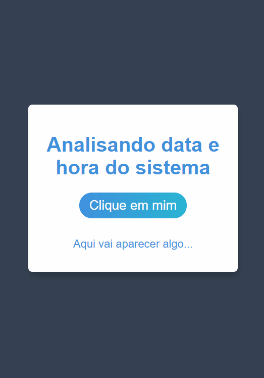

<h1>Data Atual com dados específicos</h1>

<h1 align="center">
    
</h1>

<h2>Sobre o Projeto</h2>

Esta aplicação informa a data atual. Para isso necessita clicar em "Clique em mim" e como resultado será os dados da data atual.
 

Essa aplicação foi inspirada nos desafios do <a href="https://gustavoguanabara.github.io/javascript/exercicios/">Gustavo Guanabara</a>.

<h2>Tecnologias</h2>

As seguintes ferramentas foram usada na construção do projeto.

<ul>
    <li>HTML</li>
    <li>CSS</li>
    <li>Javascript</li>
</ul>

<h2>Pré Requisitos para execução do Projeto</h2>

Para iniciar será necessário instalar:

<ul>
    <li>VSCode;</li>
    <li>No VSCode, a extensão "Live Server";</li>
</ul>

Ao abrir no VSCode o projeto e clicar para abrir a página do Live Server, ficará vísivel o projeto.

Veja meu Linkedin: <a href="https://www.linkedin.com/in/souzasamuelp/">Samuel Souza</a>

Veja meu Github: <a href="https://github.com/souzasamuelp">Samuel Souza</a>
